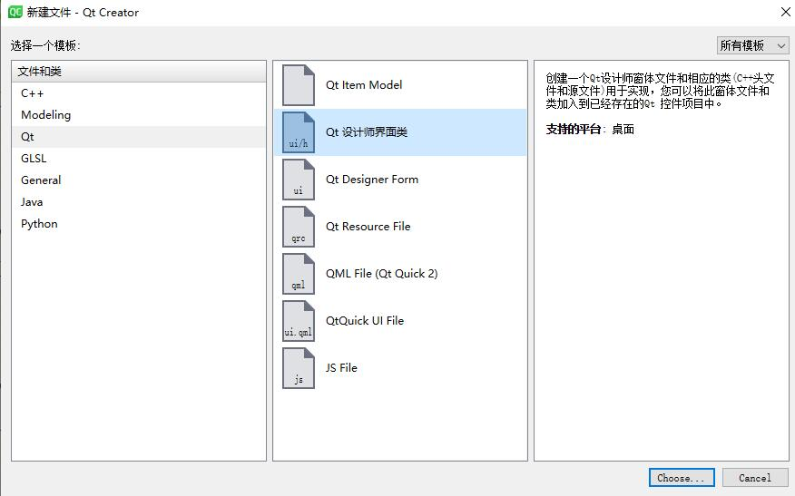
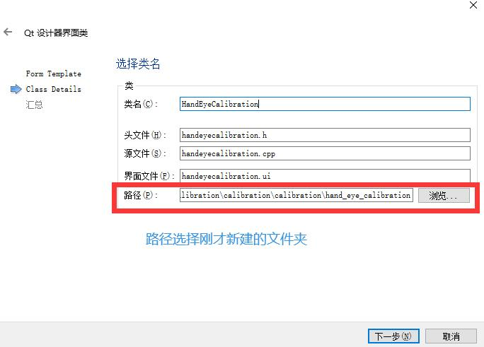
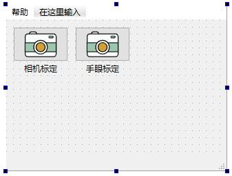
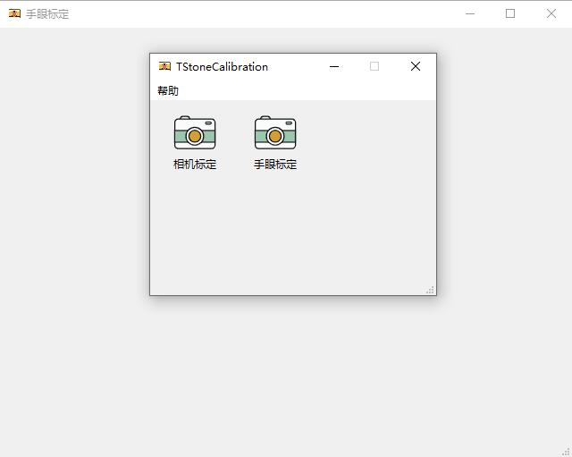

# TStoneCalibration
计算机视觉标定工具箱

计算机视觉标定工具箱项目由香港中文大学天石机器人研究所嵌入式AI组发起，基于Qt和OpenCV开发，目标是做一款可以满足各种视觉设备标定的工具箱。

目前已开发的标定工具有：
* 光学相机内参标定工具

## 文件结构
|文件名/文件夹名|功能|
|:--|:--|
|main.cpp|程序入口|
|mainwindow.cpp|工具箱主界面|
|AboutUs.cpp|【关于我们】对话框的实现|
|camera_calibration|光学相机内参标定工具|

每一个标定工具文件夹里有更详细的README介绍文件。

## 下载
Release页面有最新的Windows程序下载。

## Contribute
### 环境配置
1. 安装Qt以及Qt Creator，使用Qt Creator打开`TStoneCalibration.pro`
2. 修改`TStoneCalibration.pro`中OpenCV的头文件路径和动态链接库的路径为你当前电脑里对应的路径
```txt
INCLUDEPATH += C:/Users/uncle/Desktop/OpenCV/install/include\
               C:/Users/uncle/Desktop/OpenCV/install/include/opencv\
               C:/Users/uncle/Desktop/OpenCV/install/include/opencv2

LIBS += C:/Users/uncle/Desktop/OpenCV/install/x86/mingw/lib/libopencv_core310.dll.a\
        C:/Users/uncle/Desktop/OpenCV/install/x86/mingw/lib/libopencv_calib3d310.dll.a\
        C:/Users/uncle/Desktop/OpenCV/install/x86/mingw/lib/libopencv_highgui310.dll.a\
        C:/Users/uncle/Desktop/OpenCV/install/x86/mingw/lib/libopencv_imgcodecs310.dll.a\
        C:/Users/uncle/Desktop/OpenCV/install/x86/mingw/lib/libopencv_imgproc310.dll.a\
        C:/Users/uncle/Desktop/OpenCV/install/x86/mingw/lib/libopencv_features2d310.dll.a
```
修改上述内容。
3. 如果你在Linux上开发，需安装`v4l2`库。
```bash
sudo apt-get install libv4l-dev
```

### 开发
在此基础上可以很容易添加新的工具，添加流程如下（以下假设要添加一个名为`Hand_eye_calibration`的工具）：

#### 1.新建文件夹
在根目录下新建一个名为`hand_eye_calibration`的文件夹。

#### 2.创建程序入口函数
使用Qt Creator在该文件夹下新建一个UI，命名为HandEyeCalibration



这会自动创建`handeyecalibration.cpp`，`handeyecalibration.h`，`handeyecalibration.ui`三个文件。

#### 3.在工具箱界面中添加图标
打开`mainwindow.ui`，添加工具图标。


该图标由一个QPushButton和一个QLable组成，QPushButton的名字我设置为`HandEyeCalib`。

#### 4.添加相关逻辑
打开`mainwindow.h`，添加头文件：
```cpp
#include "hand_eye_calibration/handeyecalibration.h"
```

添加私有成员变量和槽函数
```cpp
class MainWindow : public QMainWindow
{
    Q_OBJECT

public:
    explicit MainWindow(QWidget *parent = nullptr);
    ~MainWindow();

private slots:
    void startCameraCalib();
    void showIntro();
	void startHandEyeCalib();	// 添加这一行

private:
    Ui::MainWindow *ui;
    CameraCalibration* camera_calibration;
    QAction *about;
    AboutUs *a;
	HandEyeCalibration *hand_eye;	// 添加这一行
};
```

打开`mainwindow.cpp`，添加槽函数的实现：
```cpp
MainWindow::MainWindow(QWidget *parent) :
    QMainWindow(parent),
    ui(new Ui::MainWindow)
{
    ui->setupUi(this);
    setFixedSize(this->width(), this->height());
    ui->CameraCalib->setFlat(true);
    connect(ui->CameraCalib, SIGNAL(clicked()), this, SLOT(startCameraCalib()));
    about = ui->menu->addAction("关于");
    QFont font = about->font();
    font.setPixelSize(12);
    about->setFont(font);
    connect(about, SIGNAL(triggered()), this, SLOT(showIntro()));
	// 添加下面这两行，关联按钮信号和槽函数
	ui->HandEyeCalib->setFlat(true);	// 设置QPushButton颜色透明
	connect(ui->HandEyeCalib, SIGNAL(clicked()), this, SLOT(startHandEyeCalib()));
}

void MainWindow::startHandEyeCalib()
{
    hand_eye = new HandEyeCalibration();
    QFont font = hand_eye->font();
    font.setPixelSize(12);
    hand_eye->setFont(font);
    hand_eye->setWindowTitle("手眼标定");
    hand_eye->show();
}
```

#### 5.编译运行


添加成功！你可以专心开发你的工具了。