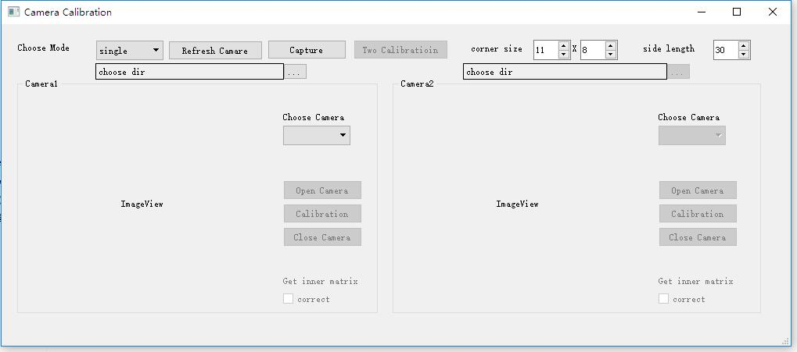

# camera_calibration
相机标定程序

基于Qt和OpenCV开发，角点检测部分为MATLAB的角点检测算法的C++实现，并优化实现了多棋盘检测和大畸变鱼眼镜头下棋盘的检测。

功能列表：
* 角点检测，支持多棋盘检测（代码逻辑见[基于生长的棋盘格角点检测](https://github.com/imuncle/imuncle.github.io/issues/113)）
* 单目传统相机标定，采用张正友标定法，支持模式选择，用户可选择径向畸变参数的个数和是否标定切向畸变
* 单目鱼眼相机标定
* 双目传统/鱼眼相机标定，无需预先单独标定单个相机
* 支持打开摄像头采集图片
* 支持畸变矫正预览和重投影预览
* 支持导出畸变矫正后的图片

可在release界面下载Windows可运行二进制程序。

软件运行截图：

